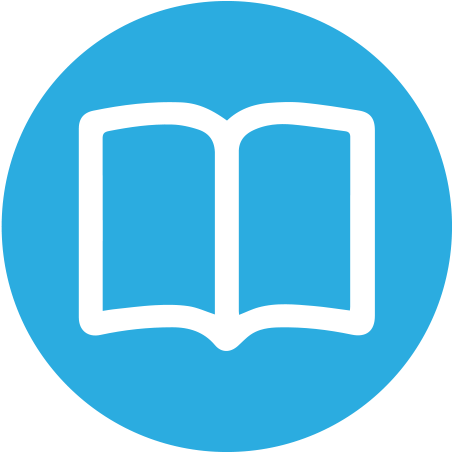

> ## **Material de Apoio**

A seguir são apresentados textos, sites, livros e vídeos que constituem material de apoio para os recursos, ferramentas, softwares e metodologias de desenvolvimento empregados no Projeto Minha IES.

> ## Metodologia

A ser escrito.

> ## Sites

<!--
> ### JavaScript / TypeScript
-->

> ## Livros

1. MARTIN, Robert C. Código Limpo: habilidades práticas do agile software. Rio de Janeiro: Alta Books, 2009.

1. MARTIN, Robert C. Arquitetura limpa: O guia do artesão para estrutura e design de software. Rio de Janeiro: Alta Books, 2019.

1. FOWLER, Martin. Refatoração: aperfeiçoando o design de códigos existentes. São Paulo: Novatec, 2020.

1. EVAN, Eric. Domain-Driven Design: atacando as complexidades no coração do software. 3ª ed. Rio de Janeiro: Alta Books, 2016.

1. GAMMA, Erich _et al_. Padrões de Projetos: soluções reutilizáveis de software orientados a objetos. Porto Alegre: Bookman, 2000.

1. MARTIN, Robert C. O codificador limpo: Um código de conduta para programadores. Rio de Janeiro: Alta Books, 2012.

> ## Vídeos

