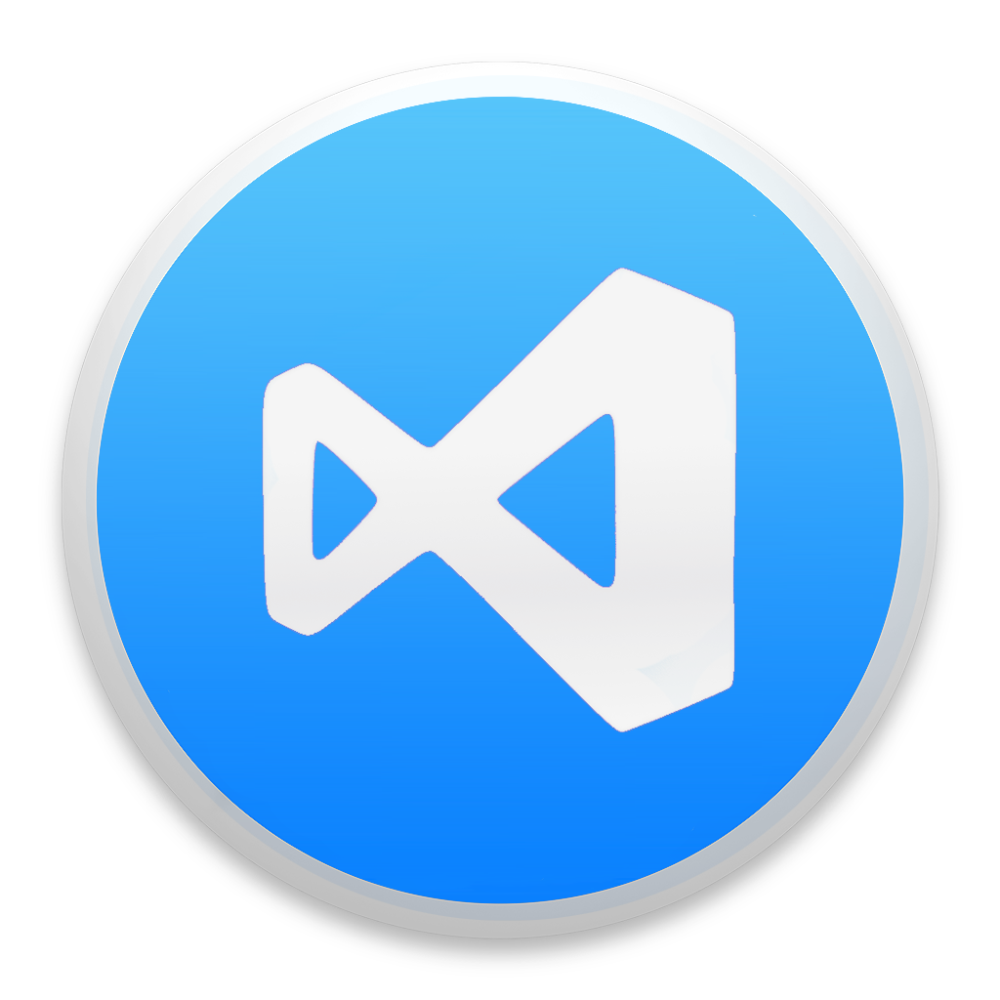

># **Visual Studio Code**

O Visual Studio Code, ou simplesmente *VSCODE* é um editor de código-fonte desenvolvido pela Microsoft para Windows, Linux e macOS. Ele inclui suporte para depuração, controle de versionamento Git incorporado, realce de sintaxe, complementação inteligente de código, snippets e refatoração de código. Ele é customizável, permitindo que os usuários possam mudar o tema do editor, teclas de atalho e preferências.

## Extensões Recomendadas

Para um melhor gerenciamento das extensões do VSCode utilize diferentes perfis (<a href="https://code.visualstudio.com/docs/editor/profiles">profiles</a>) para cada ambiente de desenvolvimento.

### Gerais (Backend & Frontend)

Nome               | Provedor         | Descrição 
-------------------|------------------|-----------
Dracula Official   | Dracula Theme    | Tema oficial Drácula. Um tema sombrio para muitos editores, shells e muito mais. 
Indent Rainbow     | oderwat          | Colore as identações no código, alternando quatro cores diferentes a cada nível. 
Better Comments    | Aaron Bond       | Destacas comentários de código anotando com alertas, informativos, TODOs, etc.
Markdown Preview Enhanced| Yiyi Wang  | Suporte para linguagem Markdown (.md)
Reload             | natqe            | Adiciona botão para recarregar (reload) as configuração do VSCode 
vscode-icons       | VSCode Icons Team| Define um conjunto de ícones para as pastas do projeto facilitando a identificação. 
vscode-drawio      | eightHundreds | Integra o VSCode com Draw.io do Google 
EditorConfig for VS Code | EditorConfig | Tenta substituir as configurações do usuário/espaço de trabalho pelas configurações encontradas no arquivo ".editorconfig". 
Cucumber (Gherkin) | Alexander Krechik | Suporte para a notação Gherkin (Cucumber) para especificações BDD

### Backend

Nome              | Provedor         | Descrição
------------------|------------------|-----------
ESLint            | Microsot         | Integra o ESLint JavaScript no VS Code.
OpenAPI (Swagger) Editor | 42Crunch | Adiciona suporte avançado para edição de especificação OpenAPI no formato JSON ou YAML.

### Frontend

Nome              | Provedor         | Descrição
-------------------|------------------|-----------
Dart              | Dart Code        | Suporte e debugger para Dart
Flutter           | Dart Code        | Suporte e debugger para Flutter
dart-import       | Luan             | Deixa todos os imports Dart com caminhos relativos.
Dart Data Class Generator | hzgood   | Cria classes Dart comuns automaticamente
Flutter Riverpod Snippets | Robert Brunhage | Snippets para Flutter Riverpod
